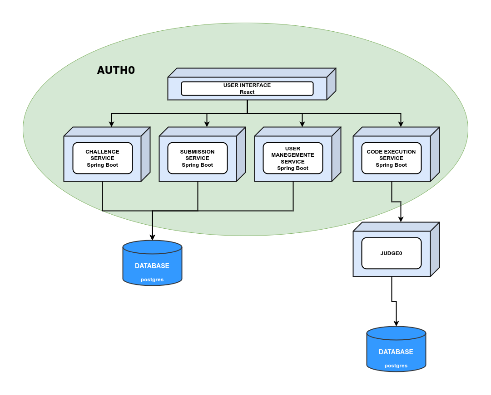

# FakeRank
The university needs a software to test their students’ coding skills by proposing programming exercises evaluated with automatic verification.

## How to deploy the system
To deploy the system, Docker and Docker Compose are needed.
After having cloned this repository, execute following command inside the
project root directory: `docker-compose up`.

Afterwards, Docker will automatically build and deploy all the artifacts of the system, exposing the application on the port `3000`. The application is made for a Linux system, 
if you want to run it on a Windows machine, in the file `judge0/judge0.conf`, you might need to convert EOL to the Linux version using a text editor (https://medium.com/@woeterman_94/how-to-solve-r-command-not-found-when-using-docker-on-windows-52f9e87cef74).

Consider that the first time the application might need some times to deploy, this because Docker needs to download all the required immages from Docker Hub.

## Architecture
Our application has a service-based architecture with four services related to:
* Challenges management ⟶ provides all the API related to the creation and editing of a challenge alongside its exercises;
* Submission management ⟶ handles the submissions for the challenges performed by the users. This includes the backup of the code and the results assigned to the students;
* User management ⟶ provides a service related to all the info regarding the users;
* Code execution ⟶ provides a service with purpose to execute the code written by the users.

All these are independent spring-boot services that share a common database, 
except for the last one which makes use of the Judge0 plug-in for a sandboxed code execution.

There is also a user interface, written in React, that acts as a proxy between the user and all the services.

Each component of the application makes use of the authentication and authorization services provided by Auth0.

This type of architecture is the one that fits our requirements best (modularity, simplicity, fault tolerance, etc.), because it allows to obtain most of the advantages of a distributed architecture, without increasing the system complexity too much.

